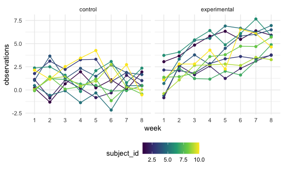
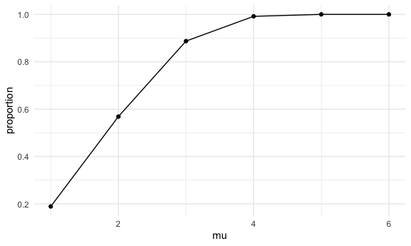
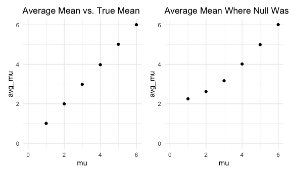

HW 5
================

## Problem 1

Read in the data.

``` r
homicide_df = 
  read_csv("./homicide_data/homicide-data.csv") %>% 
  mutate(
    city_state = str_c(city, state, sep = "_"),
    resolved = case_when(
      disposition == "Closed without arrest" ~ "unsolved",
      disposition == "Open/No arrest" ~ "unsolved",
      disposition == "Closed by arrest" ~ "solved"
    )
  ) %>% 
  select(city_state, resolved) %>% 
  filter(city_state != "Tulsa_AL")
```

    ## Parsed with column specification:
    ## cols(
    ##   uid = col_character(),
    ##   reported_date = col_double(),
    ##   victim_last = col_character(),
    ##   victim_first = col_character(),
    ##   victim_race = col_character(),
    ##   victim_age = col_character(),
    ##   victim_sex = col_character(),
    ##   city = col_character(),
    ##   state = col_character(),
    ##   lat = col_double(),
    ##   lon = col_double(),
    ##   disposition = col_character()
    ## )

Looking more closely at the data

``` r
agg_df = 
  homicide_df %>% 
  group_by(city_state) %>% 
  summarize(
    hom_total = n(),
    hom_unsolved = sum(resolved == "unsolved")
  )
```

    ## `summarise()` ungrouping output (override with `.groups` argument)

Let’s start by doing a `prop.test()` for one city.

``` r
prop.test(
  agg_df %>% filter(city_state == "Baltimore_MD") %>% pull(hom_unsolved),
  agg_df %>% filter(city_state == "Baltimore_MD") %>% pull(hom_total)
    ) %>% 
  broom::tidy()
```

    ## # A tibble: 1 x 8
    ##   estimate statistic  p.value parameter conf.low conf.high method    alternative
    ##      <dbl>     <dbl>    <dbl>     <int>    <dbl>     <dbl> <chr>     <chr>      
    ## 1    0.646      239. 6.46e-54         1    0.628     0.663 1-sample… two.sided

Let’s iterate this

``` r
results_df = 
  agg_df %>% 
  mutate(
    prop_tests = map2(.x = hom_unsolved, .y = hom_total, ~prop.test(x = .x, n = .y)),
    tidy_tests = map(.x = prop_tests, ~broom::tidy(.x))
  ) %>% 
  select(-prop_tests) %>% 
  unnest(tidy_tests) %>% 
  select(city_state, estimate, conf.low, conf.high)
```

Making a graph

``` r
results_df %>% 
  mutate(city_state = fct_reorder(city_state, estimate)) %>% 
  ggplot(aes(x = city_state, y = estimate))+
  geom_point()+
  geom_errorbar(aes(ymin = conf.low, ymax = conf.high))+
  theme(axis.text.x = element_text(angle = 90, vjust = 0.5, hjust = 1))
```


## Problem 2

Loading in 20 datasets and tidying data.

``` r
path_df = 
  tibble(
  path = list.files(path = "lda_data")
  ) %>% 
  mutate(path = str_c("lda_data/", path),
         data = map(.x = path, ~read_csv(.x))) %>% 
  unnest(data) %>% 
  mutate(arm_id = recode(path, "lda_data/con_01.csv" = "control_01", "lda_data/con_02.csv" = "control_02", "lda_data/con_03.csv" = "control_03", "lda_data/con_04.csv" = "control_04", "lda_data/con_05.csv" = "control_05", "lda_data/con_06.csv" = "control_06", "lda_data/con_07.csv" = "control_07", "lda_data/con_08.csv" = "control_08", "lda_data/con_09.csv" = "control_09", "lda_data/con_10.csv" = "control_10", "lda_data/exp_01.csv" = "experimental_01", "lda_data/exp_02.csv" = "experimental_02", "lda_data/exp_03.csv" = "experimental_03", "lda_data/exp_04.csv" = "experimental_04", "lda_data/exp_05.csv" = "experimental_05", "lda_data/exp_06.csv" = "experimental_06", "lda_data/exp_07.csv" = "experimental_07", "lda_data/exp_08.csv" = "experimental_08", "lda_data/exp_09.csv" = "experimental_09", "lda_data/exp_10.csv" = "experimental_10",)) %>% 
  separate(arm_id, into = c("arm", "subject_id"), sep = "_", convert = T) %>% 
  select(-path) %>% 
   select(arm, subject_id, everything()) %>% 
  pivot_longer(week_1:week_8,
               names_to = "week",
               names_prefix = "week_",
               values_to = "observations"
  )
```

    ## Parsed with column specification:
    ## cols(
    ##   week_1 = col_double(),
    ##   week_2 = col_double(),
    ##   week_3 = col_double(),
    ##   week_4 = col_double(),
    ##   week_5 = col_double(),
    ##   week_6 = col_double(),
    ##   week_7 = col_double(),
    ##   week_8 = col_double()
    ## )
    ## Parsed with column specification:
    ## cols(
    ##   week_1 = col_double(),
    ##   week_2 = col_double(),
    ##   week_3 = col_double(),
    ##   week_4 = col_double(),
    ##   week_5 = col_double(),
    ##   week_6 = col_double(),
    ##   week_7 = col_double(),
    ##   week_8 = col_double()
    ## )
    ## Parsed with column specification:
    ## cols(
    ##   week_1 = col_double(),
    ##   week_2 = col_double(),
    ##   week_3 = col_double(),
    ##   week_4 = col_double(),
    ##   week_5 = col_double(),
    ##   week_6 = col_double(),
    ##   week_7 = col_double(),
    ##   week_8 = col_double()
    ## )
    ## Parsed with column specification:
    ## cols(
    ##   week_1 = col_double(),
    ##   week_2 = col_double(),
    ##   week_3 = col_double(),
    ##   week_4 = col_double(),
    ##   week_5 = col_double(),
    ##   week_6 = col_double(),
    ##   week_7 = col_double(),
    ##   week_8 = col_double()
    ## )
    ## Parsed with column specification:
    ## cols(
    ##   week_1 = col_double(),
    ##   week_2 = col_double(),
    ##   week_3 = col_double(),
    ##   week_4 = col_double(),
    ##   week_5 = col_double(),
    ##   week_6 = col_double(),
    ##   week_7 = col_double(),
    ##   week_8 = col_double()
    ## )
    ## Parsed with column specification:
    ## cols(
    ##   week_1 = col_double(),
    ##   week_2 = col_double(),
    ##   week_3 = col_double(),
    ##   week_4 = col_double(),
    ##   week_5 = col_double(),
    ##   week_6 = col_double(),
    ##   week_7 = col_double(),
    ##   week_8 = col_double()
    ## )
    ## Parsed with column specification:
    ## cols(
    ##   week_1 = col_double(),
    ##   week_2 = col_double(),
    ##   week_3 = col_double(),
    ##   week_4 = col_double(),
    ##   week_5 = col_double(),
    ##   week_6 = col_double(),
    ##   week_7 = col_double(),
    ##   week_8 = col_double()
    ## )
    ## Parsed with column specification:
    ## cols(
    ##   week_1 = col_double(),
    ##   week_2 = col_double(),
    ##   week_3 = col_double(),
    ##   week_4 = col_double(),
    ##   week_5 = col_double(),
    ##   week_6 = col_double(),
    ##   week_7 = col_double(),
    ##   week_8 = col_double()
    ## )
    ## Parsed with column specification:
    ## cols(
    ##   week_1 = col_double(),
    ##   week_2 = col_double(),
    ##   week_3 = col_double(),
    ##   week_4 = col_double(),
    ##   week_5 = col_double(),
    ##   week_6 = col_double(),
    ##   week_7 = col_double(),
    ##   week_8 = col_double()
    ## )
    ## Parsed with column specification:
    ## cols(
    ##   week_1 = col_double(),
    ##   week_2 = col_double(),
    ##   week_3 = col_double(),
    ##   week_4 = col_double(),
    ##   week_5 = col_double(),
    ##   week_6 = col_double(),
    ##   week_7 = col_double(),
    ##   week_8 = col_double()
    ## )
    ## Parsed with column specification:
    ## cols(
    ##   week_1 = col_double(),
    ##   week_2 = col_double(),
    ##   week_3 = col_double(),
    ##   week_4 = col_double(),
    ##   week_5 = col_double(),
    ##   week_6 = col_double(),
    ##   week_7 = col_double(),
    ##   week_8 = col_double()
    ## )
    ## Parsed with column specification:
    ## cols(
    ##   week_1 = col_double(),
    ##   week_2 = col_double(),
    ##   week_3 = col_double(),
    ##   week_4 = col_double(),
    ##   week_5 = col_double(),
    ##   week_6 = col_double(),
    ##   week_7 = col_double(),
    ##   week_8 = col_double()
    ## )
    ## Parsed with column specification:
    ## cols(
    ##   week_1 = col_double(),
    ##   week_2 = col_double(),
    ##   week_3 = col_double(),
    ##   week_4 = col_double(),
    ##   week_5 = col_double(),
    ##   week_6 = col_double(),
    ##   week_7 = col_double(),
    ##   week_8 = col_double()
    ## )
    ## Parsed with column specification:
    ## cols(
    ##   week_1 = col_double(),
    ##   week_2 = col_double(),
    ##   week_3 = col_double(),
    ##   week_4 = col_double(),
    ##   week_5 = col_double(),
    ##   week_6 = col_double(),
    ##   week_7 = col_double(),
    ##   week_8 = col_double()
    ## )
    ## Parsed with column specification:
    ## cols(
    ##   week_1 = col_double(),
    ##   week_2 = col_double(),
    ##   week_3 = col_double(),
    ##   week_4 = col_double(),
    ##   week_5 = col_double(),
    ##   week_6 = col_double(),
    ##   week_7 = col_double(),
    ##   week_8 = col_double()
    ## )
    ## Parsed with column specification:
    ## cols(
    ##   week_1 = col_double(),
    ##   week_2 = col_double(),
    ##   week_3 = col_double(),
    ##   week_4 = col_double(),
    ##   week_5 = col_double(),
    ##   week_6 = col_double(),
    ##   week_7 = col_double(),
    ##   week_8 = col_double()
    ## )
    ## Parsed with column specification:
    ## cols(
    ##   week_1 = col_double(),
    ##   week_2 = col_double(),
    ##   week_3 = col_double(),
    ##   week_4 = col_double(),
    ##   week_5 = col_double(),
    ##   week_6 = col_double(),
    ##   week_7 = col_double(),
    ##   week_8 = col_double()
    ## )
    ## Parsed with column specification:
    ## cols(
    ##   week_1 = col_double(),
    ##   week_2 = col_double(),
    ##   week_3 = col_double(),
    ##   week_4 = col_double(),
    ##   week_5 = col_double(),
    ##   week_6 = col_double(),
    ##   week_7 = col_double(),
    ##   week_8 = col_double()
    ## )
    ## Parsed with column specification:
    ## cols(
    ##   week_1 = col_double(),
    ##   week_2 = col_double(),
    ##   week_3 = col_double(),
    ##   week_4 = col_double(),
    ##   week_5 = col_double(),
    ##   week_6 = col_double(),
    ##   week_7 = col_double(),
    ##   week_8 = col_double()
    ## )
    ## Parsed with column specification:
    ## cols(
    ##   week_1 = col_double(),
    ##   week_2 = col_double(),
    ##   week_3 = col_double(),
    ##   week_4 = col_double(),
    ##   week_5 = col_double(),
    ##   week_6 = col_double(),
    ##   week_7 = col_double(),
    ##   week_8 = col_double()
    ## )

``` r
graph = 
  path_df %>% 
  ggplot(aes(x = week, y = observations, group = subject_id, color = subject_id))+
  geom_point()+
  geom_line()+
  facet_grid(. ~ arm)

graph
```



The experimental group of subjects seemed to have the observed values
increase over the eight weeks, while the control group on the whole did
not appear to have much meaningful change in observed values. Some
subjects in the control group appeared to have an increase in values,
while others had decreasing values, and still others had values that
remained the same across the eight weeks of observations. The range of
starting values for the control group seemed closer together as compared
to the experimental group, which seemed to have a wider range of
starting observed values.

\#\#Problem 3

``` r
okur = function(n = 30, mu = 0, sigma = 5) {
  sim_data =
    tibble(
      x = rnorm(n = n, mean = mu, sd = sigma)
    ) %>% 
    t.test(alternative = 'two.sided', paired = FALSE, conf.level = 0.95) %>% 
    broom::tidy()
}

rerun(5000, okur(mu = 0)) %>% 
  bind_rows() %>% 
  select(estimate, p.value)
```

    ## # A tibble: 5,000 x 2
    ##    estimate p.value
    ##       <dbl>   <dbl>
    ##  1    0.412  0.629 
    ##  2    0.664  0.368 
    ##  3    0.551  0.534 
    ##  4    0.567  0.487 
    ##  5   -1.65   0.0599
    ##  6    1.19   0.229 
    ##  7    0.334  0.738 
    ##  8   -1.19   0.209 
    ##  9    0.122  0.887 
    ## 10    0.684  0.472 
    ## # … with 4,990 more rows

``` r
mu_list = 
  list(
    "mu = 1" = 1,
    "mu = 2" = 2,
    "mu = 3" = 3,
    "mu = 4" = 4,
    "mu = 5" = 5,
    "mu = 6" = 6
  )
```

Getting the first plot - proportion of times the null was rejected
vs. mean

``` r
output = vector("list", length = 6)

for (i in 1:6) {
output[[i]] = 
  rerun(5000, okur(mu = mu_list[[i]])) %>% 
  bind_rows() %>% 
  select(estimate, p.value) %>% 
  summarize(
    total = n(),
    reject_null = sum(p.value <= 0.05),
    mu = mu_list[[i]]
  )
}

df_pt1 = 
  as.data.frame(do.call(rbind, lapply(output, function(x) { unlist(x)}))) %>% 
  mutate(proportion = reject_null/total) %>% 
  select(-total, -reject_null)

df_pt1 %>% 
  ggplot(aes(x = mu, y = proportion))+
  geom_point()+
  geom_line()
```



It appears that as the true value of mu increases, the proportion of
times that the null was rejected exponentially increases, which
represents an increase in power. This graph seems to indicate that
effect size and power have a positive relationship, so as one increases,
the other increases as well.

``` r
output = vector("list", length = 6)

for (i in 1:6) {
output[[i]] = 
  rerun(5000, okur(mu = mu_list[[i]])) %>% 
  bind_rows() %>% 
  summarize(
    avg_mu = mean(estimate),
    mu = mu_list[[i]]
  )
}

avg_true = 
  as.data.frame(do.call(rbind, lapply(output, function(x) { unlist(x)}))) 

avg_true_plot = 
  avg_true %>%
  ggplot(aes(x = mu, y = avg_mu))+
  geom_point()+
  coord_cartesian(xlim = c(0,6), ylim = c(0,6))+
  ggtitle(label = "Average Mean vs. True Mean")

output = vector("list", length = 6)

for (i in 1:6) {
output[[i]] = 
  rerun(5000, okur(mu = mu_list[[i]])) %>% 
  bind_rows() %>% 
  filter(p.value <= 0.05) %>% 
  summarize(
    avg_mu = mean(estimate),
    mu = mu_list[[i]]
  )
}

avg_reject = as.data.frame(do.call(rbind, lapply(output, function(x) { unlist(x)}))) 

avg_reject_plot = 
  avg_reject %>% 
  ggplot(aes(x = mu, y = avg_mu))+
  geom_point()+
  coord_cartesian(xlim = c(0,6), ylim = c(0,6))+
  ggtitle(label = "Average Mean Where Null Was Rejected vs. True Mean")

avg_true_plot + avg_reject_plot
```



There is a clear difference in the two plots for the lower true mean
values. The average means are nearly identical to the true means for all
p-values. However, there are clear differences when we limit our sample
to only simulated situations in which the p-value is at or under 0.05.
The averages are quite far from the true mean for the true means of 1
and 2, but the averages get a lot closer to the true mean for the true
means of 3 through 6, with the averages for 5 and 6 being closest to the
true means.
